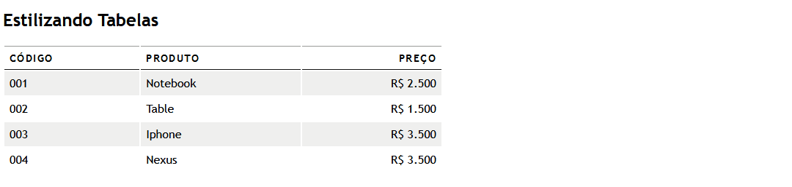

<h2 align="center">
Tabela Estelizada
</h2>

Estelizando uma tabela simples, onde cores alternadas no seu fundo, espaçamento dos títulos,
deixando Títulos principais em letras maiúsculas e alinhados em seu primeiro commit.

<h1 align="center">

